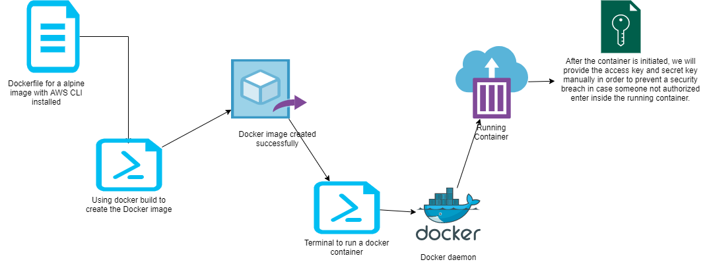

# Trambo-Dockerfile
Marzo 2020, Dockerfile used to create and docker image with aws cli installed.



```
FROM alpine
MAINTAINER Elmer-Trambo
ENV AWSCLI_VERSION "1.16.300"
RUN apk update && apk add bash\
    python \
    python-dev \
    py-pip \
    build-base \
    && pip install awscli==$AWSCLI_VERSION --upgrade --user \
    && apk --purge -v del py-pip \
    && rm -rf /var/cache/apk/*\
    aws configure
ENTRYPOINT ["/root/.local/bin/aws"]
```